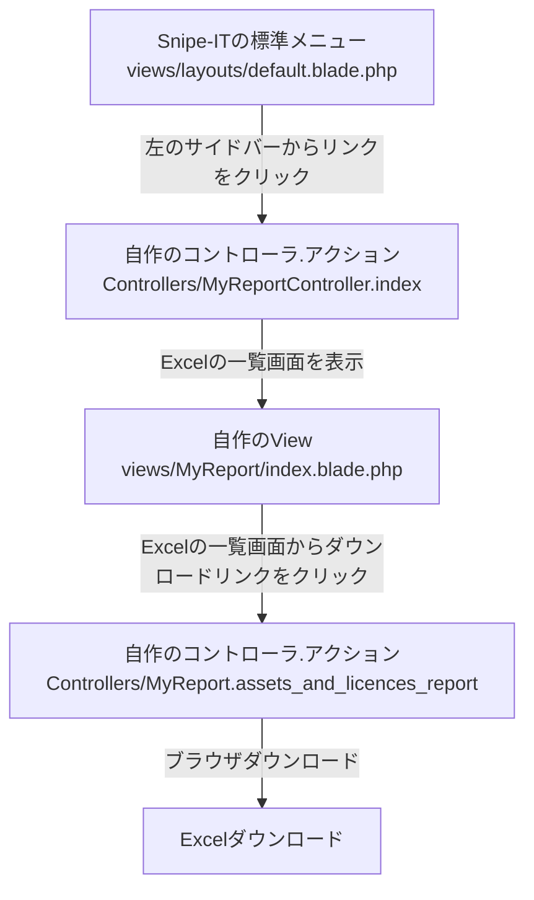
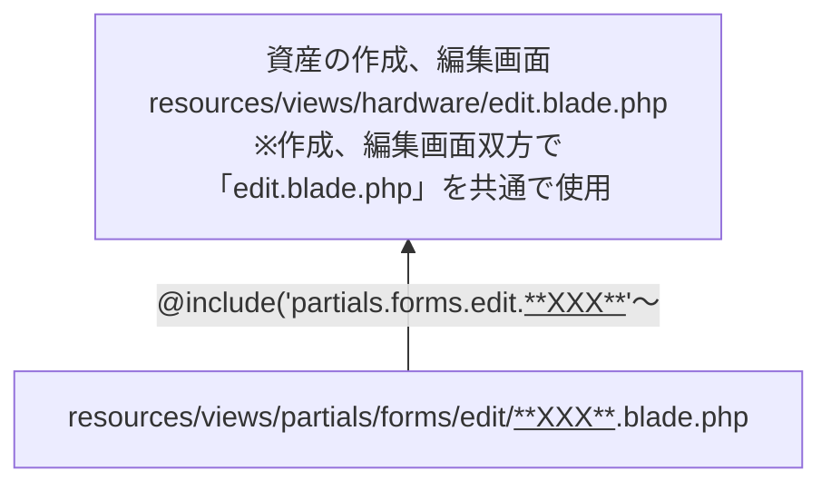
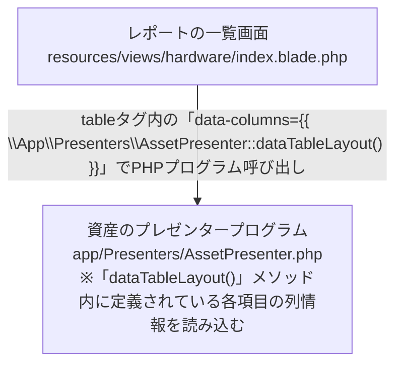
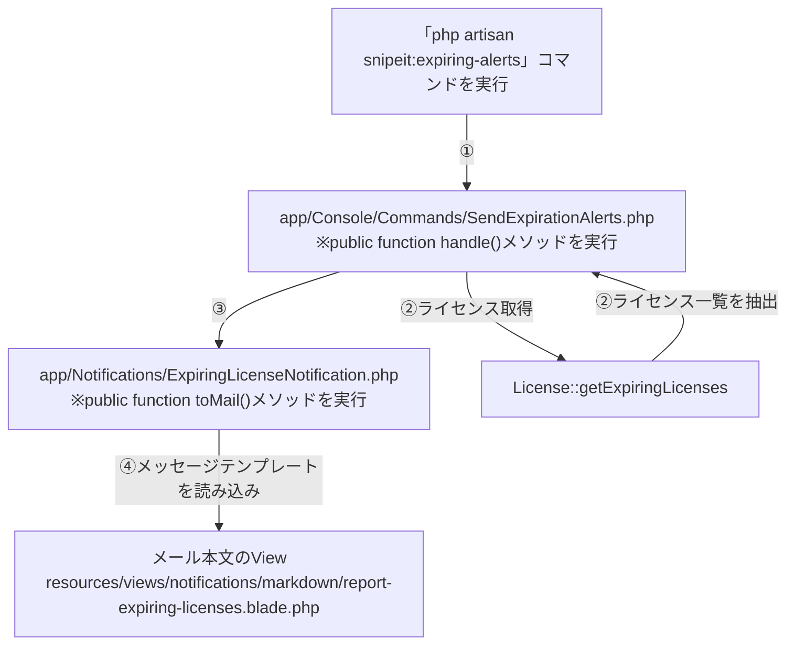
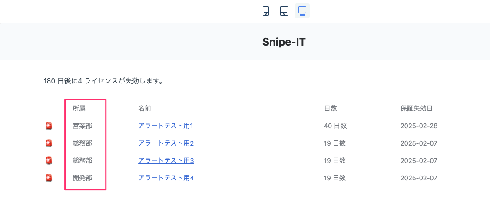
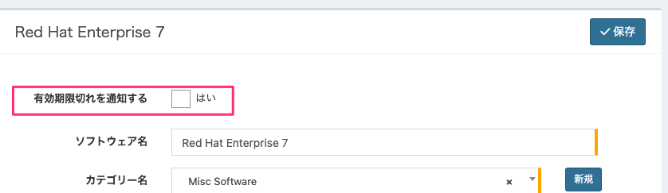
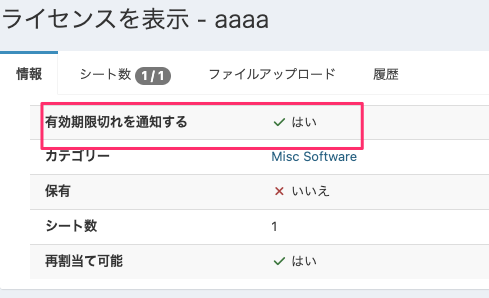
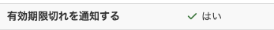
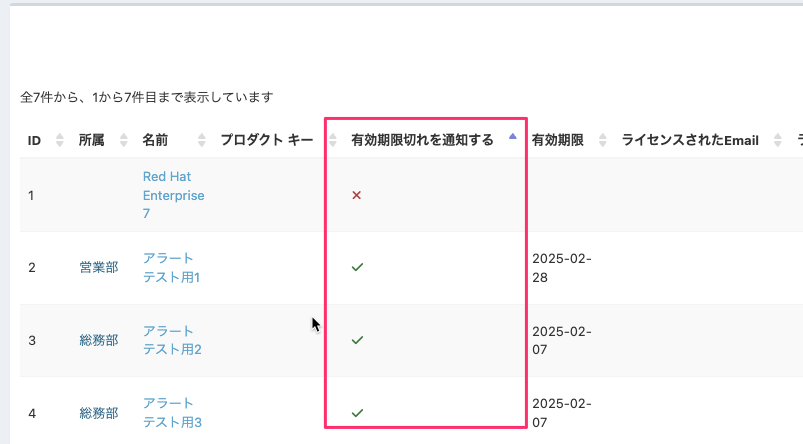

# はじめに

OSS製品であるSnipe-ITの機能改修に関する手順をここにまとめる。
なお、Snipe-IT`v7.0.13-pre`を前提としている。

前提とする環境は以下の通り。

| 項目名             | 値                                                     |
|-----------------|-------------------------------------------------------|
| OS           | Redhat9.5                                             |
| OSホスト名       | snipe-it-test                                         |
| MySQL           | 8.0.36                                                |
| PHP             | 8.1.27                                                |
| Apache          | 2.4.57                                                |
| Snipe-ITのバージョン  | 7.0.13                                                |
| Snipe-ITのディレクトリ | /var/www/snipeit                                      |


# 任意のSQLを実行してExcelダウンロードさせる機能を実装する

任意のSQLを実行し、その結果をExcelでダウンロードできる機能を実装する手順を記載する。

## 実装後のイメージ

### 作成するプログラムの仕様
本稿では、下記の構成であることを前提にする。

| 項目           | 値                         |
| -------------- | -------------------------- |
| コントローラ名 | MyReportController         |
| アクション     | assets_and_licenses_report |


### MVCフローチャート

MVCフローチャートは以下の通り。



### 画面の操作イメージ
1. 左のサイドバーのレポート一覧に`カスタムレポート`リンクが追加される。

    

2. リンクをクリックすると、カスタムレポートの一覧画面に遷移し、リンクをクリックするとExcelダウンロードが始まる。

    

    ↓

    

## ①Composerライブラリの導入
下記コマンドで必要なライブラリを導入しておくこと。
※後述の`php artisan make:export`コマンドを実行する際に必要となる

```bash
 composer require maatwebsite/excel
```


## ②エクスポートクラスを作成する
SQLを実行してExcel出力するためのエクスポートクラスを作成する。

以下のコマンドを実行してクラスを作成する。
```bash
php artisan make:export SqlExport
```

生成されたエクスポートクラスを以下の通り修正する。

app/Exports/SqlExport.php
```php
<?php

namespace App\Exports;

use Illuminate\Support\Facades\DB;
use Maatwebsite\Excel\Concerns\FromCollection;

// Excelにヘッダを付与するためのライブラリ
use Maatwebsite\Excel\Concerns\WithHeadings;

class SqlExport implements FromCollection, WithHeadings
{
    // ----- プロパティ変数
    protected $query;
    protected $headings;

    // ----- コンストラクタ
    // SQLクエリとヘッダを受け取る
    public function __construct($query, $headings = [])
    {
        $this->query = $query;
        $this->headings = $headings;
    }

    // ----- 各種メソッド
    /**
     * プロパティ変数のSQLを実行し、コレクションとして返す
     *
     * @return \Illuminate\Support\Collection
     */
    public function collection()
    {
        // クエリを実行して結果を返す
        return collect(DB::select($this->query));
    }

    /**
     * Excelのヘッダを配列として返す。
     *
     * @return array
     */
    public function headings(): array
    {
        // プロパティ変数のヘッダ情報を返す。もしプロパティ変数が存在しなれば空の配列を返す
        return $this->headings ?: [];
    }
}
```

## ③コントローラ作成

下記コマンドでコントローラを作成する。

```bash
php artisan make:controller MyReportController
```

作成したコントローラを以下の通り修正する。

app/Http/Controllers/MyReportController.php
```php
<?php

namespace App\Http\Controllers;

// DBアクセスに必要なライブラリ
use Illuminate\Support\Facades\DB;

// SQLで実行したデータセットをExcelでダウンロードさせるために必要なライブラリ
use App\Exports\SqlExport;
use Maatwebsite\Excel\Facades\Excel;

class MyReportController extends Controller
{
    /**
     * カスタムレポートのダウンロード一覧画面を表示するアクションメソッド
     */
    public function index()
    {
        return view('MyReport.index');
    }

    /**
     * 資産とライセンス情報を並列で抽出し、Excelでダウンロードさせるアクションメソッド。
     */

    public function assets_and_licences_report()
    {
        // SQLで使用する各種テーブル名を、モデルクラスから抽出する
        // ※文字列内でテーブル名を直書きしないようにするため
        $tableNameAsset = (new Asset())->getTable();
        $tableNameLicense = (new License())->getTable();
        $tableNameLicenseSeat = (new LicenseSeat())->getTable();

        // テーブルのカラム名と、Excelに出力するヘッダ名の対応配列変数を定義
        // ※general.phpで機械的に抽出できない日本語名があるため（資産名など）、明示的に定義
        // ※general.phpで取得できる項目については、trans()メソッドを用いて取得
        $columnHeaderHash = [
            // テーブルカラム名 => Excelヘッダ名
            "{$tableNameAsset}.name" => (trans('general.asset') . "名"),
            "{$tableNameLicense}.name" => trans('general.license'),
        ];
        // 連想配列からカラム名（Key）のみを抽出して配列変数に格納
        $columns = array_keys($columnHeaderHash);
        // 連想配列からExcelヘッダ名（Value）のみを抽出して配列変数に格納
        $headers = array_values($columnHeaderHash);

        //クエリビルダでSQLを生成し、文字列に変換して変数に格納する
        $sqlStr = DB::table($tableNameAsset)
            ->select($columns)
            ->leftJoin(
                $tableNameLicenseSeat
                , "{$tableNameAsset}.id", '=', "{$tableNameLicenseSeat}.asset_id"
            )
            ->leftJoin(
                $tableNameLicense
                , "{$tableNameLicenseSeat}.license_id", '=', "{$tableNameLicense}.id"
            )
            ->toSql()
        ;

        // Excelエクスポート用オブジェクトを定義
        $sqlExportObj = new SqlExport(
            $sqlStr,
            $headers
        );

        // Excelファイルのダウンロードを実行
        return Excel::download($sqlExportObj, '資産情報とライセンスの一覧.xlsx');
    }
}
```

## ④ルーティング設定
下記ファイルを編集し、ルーティングを編集する。

routes/web.php

```php
<?php
・・・
★↓追記
// 自作のカスタムレポートのルーティング情報
use App\Http\Controllers\MyReportController;
・・・

Route::group(['middleware' => ['auth']], function () {
・・・
	★↓追記
    // 自作のカスタムレポートのルーティング情報
    Route::get('/MyReport/assets_and_licences_report', [MyReportController::class, 'assets_and_licences_report']);
・・・
```

上記を追記したら、以下のアドレスにアクセスする。

http://<IPアドレス>/MyReport/assets_and_licences_report

## サイドバーに新たに自作のカスタムレポート画面へのリンクを作成する

「[前述の手順](#任意のSQLを実行してExcelダウンロードさせる機能を実装する)」で作成したコントローラに新たに`index`アクションを追加し、Snipe-ITのサイドバーにリンクを追加してアクセスできるようにする。

### ①コントローラ、ルーティング作成
まずコントローラにアクションを追加し、ルーティングを追加する。

app/Http/Controllers/MyReportController.php

```php
・・・
    /**
     * カスタムレポートのダウンロード一覧画面を表示するアクションメソッド
     */
    public function index()
    {
        return view('MyReport.index');
    }
・・・
```

routes/web.php

```php
・・・
    Route::get('/MyReport', [MyReportController::class, 'index']);
・・・
```

また、後述のビューに埋め込むリンクで使用するため、レポートダウンロード用のルーティングに名前をつける。

routes/web.php

```php
・・・
    // 資産情報とライセンスを並列で出力するレポートのダウロード用アクション
    Route::get('/MyReport/assets_and_licences_report', [MyReportController::class, 'assets_and_licences_report'])
        ->name('myreport/assets_and_licences_report');　★ここの設定を追記する
・・・
```

### ②ラベルの定義
Snipe-ITでは、ラベルはあらかじめ所定のPHPに定義する必要がある。
下記を追記する。

resources/lang/ja-JP/general.php

```php
<?php

return [
・・・
    // 自作のカスタムレポートのラベル
    'my_report'        => 'カスタムレポート',
・・・
```

上記で定義したラベルは下記で呼び出すことができる。
```php
{{ trans('general.my_report') }}
```

### ③カスタムレポートの一覧ビューの作成

先ほど作成したコントローラへのリンクするビューを作成する。

以下のビューを作成すること。
resources/views/CustomReport/index.blade.php
```php
@extends('layouts/default')

{{-- Page title --}}
@section('title')
{{ trans('general.my_report') }}
@parent
@stop

{{-- Page content --}}
@section('content')

<div class="text-center col-md-12" style="padding-top: 10px;">
  <a href="{{ route('myreport/assets_and_licences_report') }}" class="btn btn-primary btn-sm" style="width: 100%">
    すべての資産情報とライセンスをまとめてExcelダウンロード
  </a>
</div>

@stop

@section('moar_scripts')
@include ('partials.bootstrap-table')
@stop
```

※`{{ route('myreport/assets_and_licences_report') }}`は、[こちら](#コントローラルーティング作成)で記述したルーティングの名前（`->name`）に対応する。

# 資産情報の標準項目を非表示にする

## 新規作成/編集画面の項目を非表示にする

### プログラムの構成

Snipe-ITで標準で存在する項目を画面上から非表示にしたい場合の手順を示す。

前提として、Snipe-ITでは下記の構成で画面項目を表示している。

[イメージ]



### 具体的な修正手順

ここでは資産情報の`シリアル`を非表示にする方法を記載する。


以下のファイルを変更する。

resources/views/partials/forms/edit/serial.blade.php
```html
<!-- Serial -->
<div class="form-group {{ $errors->has('serial') ? ' has-error' : '' }}">
    <label for="{{ $fieldname }}" class="col-md-3 control-label">{{ trans('admin/hardware/form.serial') }} </label>
    <div class="col-md-7 col-sm-12{{  (Helper::checkIfRequired($item, 'serial')) ? ' required' : '' }}">
        <input class="form-control" type="text" name="{{ $fieldname }}" id="{{ $fieldname }}" value="{{ old((isset($old_val_name) ? $old_val_name : $fieldname), $item->serial) }}" />
        {!! $errors->first('serial', '<span class="alert-msg" aria-hidden="true"><i class="fas fa-times" aria-hidden="true"></i> :message</span>') !!}
    </div>
</div>
```

↓

```html
<!-- Serial -->
{{-- ↓ここから↓

<div class="form-group {{ $errors->has('serial') ? ' has-error' : '' }}">
    <label for="{{ $fieldname }}" class="col-md-3 control-label">{{ trans('admin/hardware/form.serial') }} </label>
    <div class="col-md-7 col-sm-12{{  (Helper::checkIfRequired($item, 'serial')) ? ' required' : '' }}">

↑ここまでコメントアウト↑--}}

{{-- 「type="text"→「type="hidden"」に変更 --}}
        <input class="form-control" type="hidden" name="{{ $fieldname }}" id="{{ $fieldname }}" value="{{ old((isset($old_val_name) ? $old_val_name : $fieldname), $item->serial) }}" />

{{-- ↓ここから↓
            {!! $errors->first('serial', '<span class="alert-msg" aria-hidden="true"><i class="fas fa-times" aria-hidden="true"></i> :message</span>') !!}
    </div>
</div>
↑ここまでコメントアウト↑--}}
```

★`input`はコメントアウトしないこと。例え空欄の情報であっても、サーバにパラメータを送信しなければエラーを引き起こす。

## レポートの一覧画面から非表示にする

### プログラムの構成

まず、レポートの一覧画面は以下の構成になっている。



### 具体的な修正手順

下記の通りコメントアウトすれば良い。

app/Presenters/AssetPresenter.php
```php
...
                'sortable' => true,
                'switchable' => false,
                'title' => trans('admin/hardware/table.asset_tag'),
                'visible' => true,
                'formatter' => 'hardwareLinkFormatter',
            ],
             /* 一覧画面の「シリアル」のヘッダを非表示にする
            [
                'field' => 'serial',
                'searchable' => true,
                'sortable' => true,
                'title' => trans('admin/hardware/form.serial'),
                'visible' => true,
                'formatter' => 'hardwareLinkFormatter',
            ],
            */  [
                'field' => 'model',
                'searchable' => true,
...
```

## カスタムレポート画面から非表示にする

カスタムレポートで指定する項目を非表示にする。


修正箇所は以下の通り。

resources/views/reports/custom.blade.php

```html
・・・
              <label class="form-control">
                {{ Form::checkbox('category', '1', '1') }}
                {{ trans('general.category') }}
              </label>

              {{-- ↓ここから↓
              <label class="form-control">
                {{ Form::checkbox('serial', '1', '1') }}
                {{ trans('admin/hardware/table.serial') }}
              </label>
              ↑ここまでコメントアウト↑--}}

              <label class="form-control">
                {{ Form::checkbox('purchase_date', '1', '1') }}
                {{ trans('admin/licenses/table.purchase_date') }}
              </label>
・・・
```

# ライセンスのアラートメールの本文をカスタマイズする

MVCフローチャートは以下の通り。

[イメージ]



## 本文の修正方法

下記ファイルに修正を加えること。

resources/views/notifications/markdown/report-expiring-licenses.blade.php

```php
@component('mail::message')
{{ trans_choice('mail.license_expiring_alert', $licenses->count(), ['count'=>$licenses->count(), 'threshold' => $threshold]) }}
@component('mail::table')

<table width="100%">
<tr><td>&nbsp;</td><td>{{ trans('mail.name') }}</td><td>{{ trans('mail.Days') }}</td><td>{{ trans('mail.expires') }}</td></tr>
@foreach ($licenses as $license)
@php
$expires = Helper::getFormattedDateObject($license->expiration_date, 'date');
$diff = round(abs(strtotime($license->expiration_date->format('Y-m-d')) - strtotime(date('Y-m-d')))/86400);
$icon = ($diff <= ($threshold / 2)) ? '🚨' : (($diff <= $threshold) ? '⚠️' : ' ');
@endphp
<tr><td>{{ $icon }} </td><td> <a href="{{ route('licenses.show', $license->id) }}">{{ $license->name }}</a> </td><td> {{ $diff }} {{ trans('mail.Days') }}  </td><td>{{ $expires['formatted'] }}</td></tr>
@endforeach
</table>
@endcomponent
@endcomponent
```

※`@foreach ($licenses as $license)〜@endforeach`の箇所が取得したライセンス一覧を表示している箇所となる。

## 任意のSQLを実行してメール本文内に表示したい

※ライセンス情報と所属情報を並列で出力させるロジックの実装を例にして説明する。

任意のSQLを実行させるメソッドを作成し、`php artisan snipeit:expiring-alerts`実行時に呼び出すようにする。

### ①ライセンス抽出用メソッドの定義
下記の通り、自作のライセンス抽出用のメソッドを追加する。

app/Models/License.php

```php
...
    public static function getExpiringLicensesGroupWithCompany($days = 60)
    {
        $days = (is_null($days)) ? 60 : $days;

        // 「所属」テーブル名を取得する
        $tableNameCompany=(new Company())->getTable();;

        // 「ライセンス」テーブル名を取得する
        $tableNameLicense = (new License())->getTable();

        return self::select(
                "{$tableNameLicense}.id"
                ,"{$tableNameCompany}.name as company_name"
                ,"{$tableNameLicense}.name"
                ,"expiration_date"
            )
            ->leftjoin(
                $tableNameCompany
                ,"{$tableNameCompany}.id", "=","{$tableNameLicense}.company_id"
            )
            ->whereNotNull('expiration_date')
            ->whereNull('deleted_at')
            ->whereRaw('DATE_SUB(`expiration_date`,INTERVAL '.$days.' DAY) <= DATE(NOW()) ')
            ->where('expiration_date', '>', date('Y-m-d'))
            ->orderBy(
                'company_name', 'ASC'
                ,'expiration_date', 'ASC')
            ->get();
    }
...
```

---

SELECT句の所属名は、列別名で`company_name`を付与している。これは後述の本文用View`resources/views/notifications/markdown/report-expiring-licenses-custom.blade.php`で引用するために列別名を定義している。

---

### ②追加したライセンス抽出用メソッドを呼び出すように修正

先ほど作成したメソッドを呼び出すように、以下のクラスを修正する。

app/Console/Commands/SendExpirationAlerts.php

```php
    /**
     * Execute the console command.
     *
     * @return mixed
     */
    public function handle()
    {
            ...
                \Notification::send($recipients, new ExpiringAssetsNotification($assets, $threshold));
            }

            // ★もともと存在するライセンス抽出処理をコメントアウト
            // Expiring licenses
            // $licenses = License::getExpiringLicenses($threshold);

            // ★新たに、ライセンス抽出処理を追加
            $licenses = License::getExpiringLicensesGroupWithCompany($threshold);

            if ($licenses->count() > 0) {
                $this->info(trans_choice('mail.license_expiring_alert', $licenses->count(), ['count' => $licenses->count(), 'threshold' => $threshold]));
                \Notification::send($recipients, new ExpiringLicenseNotification($licenses, $threshold));
            }
        } else {
            if ($settings->alert_email == '') {
                $this->error('Could not send email. No alert email configured in settings');
...
```
### ③追加したライセンス抽出用メソッドに合わせて、本文テンプレートを修正する

もともと存在するメール本文テンプレートを別名でコピーする。

`resources/views/notifications/markdown/report-expiring-licenses.blade.php`
｜
コピー
↓
`resources/views/notifications/markdown/report-expiring-licenses-custom.blade.php`

下記の通り修正する。

resources/views/notifications/markdown/report-expiring-licenses-custom.blade.php

```php
@component('mail::message')
    {{ trans_choice('mail.license_expiring_alert', $licenses->count(), ['count' => $licenses->count(), 'threshold' => $threshold]) }}
    @component('mail::table')
        <table width="100%">
            <tr>
                <td>&nbsp;</td>
                <td>
                  {{ # ヘッダに「所属名」を追加
                      trans('general.company')
                  }}
                </td>
                <td>{{ trans('mail.name') }}</td>
                <td>{{ trans('mail.Days') }}</td>
                <td>{{ trans('mail.expires') }}</td>
            </tr>
            @foreach ($licenses as $license)
                @php
                    $expires = Helper::getFormattedDateObject($license->expiration_date, 'date');
                    $diff = round(
                        abs(strtotime($license->expiration_date->format('Y-m-d')) - strtotime(date('Y-m-d'))) / 86400,
                    );
                    $icon = $diff <= $threshold / 2 ? '🚨' : ($diff <= $threshold ? '⚠️' : ' ');
                @endphp
                <tr>
                    <td>{{ $icon }} </td>
                    <td>
                      {{ /*
                          「app/Models/License.php」に追加したライセンス抽出用メソッドのSELECT句の別名「company_name」
                          に対応する列情報を記載する。
                        */
                          $license->company_name
                      }}
                    </td>
                    <td> <a href="{{ route('licenses.show', $license->id) }}">{{ $license->name }}</a> </td>
                    <td> {{ $diff }} {{ trans('mail.Days') }} </td>
                    <td>{{ $expires['formatted'] }}</td>
                </tr>
            @endforeach
        </table>
    @endcomponent
@endcomponent

```

`php artisan snipeit:expiring-alerts`を実行すると、以下の通り`所属`が追加された状態でメールが送信される。




# ライセンスに項目を追加し、項目の内容に応じて期限切れアラートメールに表示する情報をカスタマイズする
## 「有効期限切れ」通知の判定フラグを追加する
ライセンスはその仕様上、カスタムフィールドを追加することができない。

本稿ではソースコードを修正して項目を追加するとともに、その項目をもとに、期限切れ通知メールに表示するライセンス情報をカスタマイズする手順を記載する。

下記の項目を追加する前提で説明する。

| 項目           | 値                 | 備考                            |
|--------------|-------------------|-------------------------------|
| 対象のモデル（テーブル） | License（licenses） | Snipe-ITに備わっている標準のモデル。        |
| 追加するカラム      | isAlert           | 有効期限切れ時に、メール通知するかどうかを識別するフラグ。 |

### ①マイグレーションファイルを作成/実行し、DBにカラムを追加する

以下のコマンドを実行し、マイグレーションファイルを作成する。

`php artisan make:migration add_isAlert_to_licenses --table=licenses`

生成されたファイルを編集する。。

database/migrations/yyyy_mm_dd_084044_add_is_alert_to_licenses.php
```php
<?php

use Illuminate\Database\Migrations\Migration;
use Illuminate\Database\Schema\Blueprint;
use Illuminate\Support\Facades\Schema;

return new class extends Migration
{
    /**
     * Run the migrations.
     */
    public function up(): void
    {
        Schema::table('licenses', function (Blueprint $table) {
            // 末尾に追加するため、after(は省略する)
            $table->boolean('is_lert')->default(false);
        });
    }

    /**
     * Reverse the migrations.
     */
    public function down(): void
    {
        Schema::table('licenses', function (Blueprint $table) {
            $table->dropColumn('is_alert');
        });
    }
};
```

アプリケーションのディレクトリで以下を実行すること。
`php artisan migrate`

下記SQLでカラムが追加されていることを確認する。
```sql
select
 isAlert
FROM
 licenses;
```

### ②Viewの修正
#### 1. 表示ラベルを定義する
下記の通り、`is_alert`の行を追記する。

/var/www/snipeit/resources/lang/ja-JP/admin/licenses/form.php
```php
<?php

return [
...
    'is_alert'         => '有効期限切れを通知する',
...
];
```

resources/lang/ja-JP/admin/licenses/general.php
```php
<?php

return array(
    // 追加した「有効期限切れを通知する」に対応する表示ラベル
    'is_alert'      => '有効期限切れを通知する',
...
```

#### 2. 編集画面に入力項目（チェック項目）を追加する

/var/www/snipeit/resources/views/licenses/edit.blade.php
```php
...
{{-- Page content --}}
@section('inputFields')

{{-- 追加した「有効期限切れを通知する」項目 --}}
{{-- @include ('partials.forms.edit.is_alert', ['translated_name' => trans('admin/licenses/form.is_alert')]) --}}
<div class="form-group {{ $errors->has('is_alert') ? ' has-error' : '' }}">
    <div class="col-md-3 control-label">
        <strong>{{ trans('admin/licenses/form.is_alert') }}</strong>
    </div>
    <div class="col-md-7">
        <label class="form-control">
        {{ Form::Checkbox('is_alert', '1', old('is_alert', $item->id ? $item->is_alert : '1'),array('aria-label'=>'is_alert')) }}
        {{ trans('general.yes') }}
        </label>
    </div>
</div>
...
```

- - -
- `trans('admin/licenses/form.is_alert')`の部分が「[こちら](#1-表示ラベルを定義する)」で定義したラベル名に連動している。

- 今回の入力項目はチェックボックスのため、パーシャルを用いないシンプルな入力フォームを実装している。
  実装においては、標準項目の`再割当て可能`を引用している。
  /var/www/snipeit/resources/views/licenses/edit.blade.php
  ```php
  ...
  <!-- Reassignable -->
  <div class="form-group {{ $errors->has('reassignable') ? ' has-error' : '' }}">
      <div class="col-md-3 control-label">
          <strong>{{ trans('admin/licenses/form.reassignable') }}</strong>
      </div>
      <div class="col-md-7">
          <label class="form-control">
          {{ Form::Checkbox('reassignable', '1', old('reassignable', $item->id ? $item->reassignable : '1'),array('aria-label'=>'reassignable')) }}
          {{ trans('general.yes') }}
          </label>
      </div>
  </div>
  ...
  ```

  - - -

ライセンスの新規作成/編集画面を確認すると、以下の通り先頭に項目が追加されている。



#### 3. 参照画面に項目を追加する
下記を追記する。

resources/views/licenses/view.blade.php
```html
...
      <div class="tab-content">

        <div class="tab-pane active" id="details">
          <div class="row">
            <div class="col-md-12">
              <div class="container row-new-striped">

                {{-- 追加した「有効期限切れを通知する」に対応する表示項目 --}}
                <div class="row">
                  <div class="col-md-3">
                    <strong>{{ trans('admin/licenses/general.is_alert') }}</strong>
                  </div>
                  <div class="col-md-9">
                    {{-- 1ならチェックあり、0ならチェック無しで表示する --}}
                    {!! $license->is_alert ? '<i class="fas fa-check fa-fw text-success" aria-hidden="true"></i> '.trans('general.yes') : '<i class="fas fa-times fa-fw text-danger" aria-hidden="true"></i> '.trans('general.no') !!}

                  </div>
                </div>

...

```

ライセンスの参照画面に遷移し、以下の通り`有効期限切れを通知する`の項目が表示されていることを確認する。



- - -
追記した`{!! $license->is_alert ? '<i class="fas fa-check fa-fw text-success" aria-hidden="true"></i> '.trans('general.yes') : '<i class="fas fa-times fa-fw text-danger" aria-hidden="true"></i> '.trans('general.no') !!}`の記述は、既存項目の`再割当て可能`を参考にしている。
そうすることで、自動的に以下のデザインで`はい`、`いいえ`が可視化される。



- - -

#### 4. 一覧画面に項目を追加する
ライセンスの一覧画面で追加した項目が表示されるようにする。

app/Presenters/LicensePresenter.php
```php
<?php

namespace App\Presenters;

/**
 * Class LicensePresenter
 */
class LicensePresenter extends Presenter
{
    /**
     * Json Column Layout for bootstrap table
     * @return string
     */
    public static function dataTableLayout()
    {
        $layout = [
...
            // 追加した「有効期限切れを通知」に対応する項目を追加
            [
                'field' => 'is_alert',
                'searchable' => true,
                'sortable' => true,
                'title' => trans('admin/licenses/form.is_alert'),
                'formatter' => 'trueFalseFormatter',
            ],
...
```

このままではDBに登録されている値が反映されないため、下記も編集する。


### ③モデルを修正する
下記の通り記述を追記する。

app/Models/License.php
```php
...
    protected $rules = [

        // 追加した「有効期限切れを通知する」に対応するチェックボックス
        'is_alert',

	]
...
    /**
     * The attributes that should be included when searching the model.
     *
     * @var array
     */
    protected $searchableAttributes = [
	...
        // 追加した「有効期限切れを通知する」に対応するチェックボックス
        'is_alert',
	];
...
    /**
     * The attributes that are mass assignable.
     *
     * @var array
     */
    protected $fillable = [
	...
        // 追加した「有効期限切れを通知する」に対応するチェックボックス
        'is_alert',
    ];
...
    /**
     * 追加した「有効期限切れを通知する」に対応するチェックボックス
     *
     * @author chiku-wa
     * @since [v1.0]
     * @return mixed
     */
    public function setIsAlertAttribute($value)
    {
        $this->attributes['is_alert'] = filter_var($value, FILTER_VALIDATE_BOOLEAN);
    }
...
```

### ④コントローラを修正する
下記記述を追記する。

app/Http/Controllers/Licenses/LicensesController.php
```php
...
    /**
     * Validates and stores the license form data submitted from the new
     * license form.
     *
     * @author [A. Gianotto] [<snipe@snipe.net>]
     * @see LicensesController::getCreate() method that provides the form view
     * @since [v1.0]
     * @param Request $request
     * @return \Illuminate\Http\RedirectResponse
     * @throws \Illuminate\Auth\Access\AuthorizationException
     */
    public function store(Request $request)
    {
		...
        // 追加した「有効期限切れを通知する」に対応するチェックボックス
        $license->is_alert           = $request->input('is_alert');
		...
    }
...
    /**
     * Validates and stores the license form data submitted from the edit
     * license form.
     *
     * @author [A. Gianotto] [<snipe@snipe.net>]
     * @see LicensesController::getEdit() method that provides the form view
     * @since [v1.0]
     * @param Request $request
     * @param int $licenseId
     * @return \Illuminate\Http\RedirectResponse
     * @throws \Illuminate\Auth\Access\AuthorizationException
     */
    public function update(Request $request, $licenseId = null)
    {
		...
        // 追加した「有効期限切れを通知する」に対応するチェックボックス
        $license->is_alert           = $request->input('is_alert');
		...
	}
```

- - -
`store`メソッドが新規作成、`update`メソッドが更新時に呼び出されるメソッドである。
- - -

### ⑤その他クラスの修正
#### レポート表示項目クラスの修正
下記記述を追記する。

app/Presenters/LicensePresenter.php

```php
    /**
     * Json Column Layout for bootstrap table
     * @return string
     */
    public static function dataTableLayout()
    {
        $layout = [
...

            // 追加した「有効期限切れを通知」に対応する項目を追加
            [
                'field' => 'is_alert',
                'searchable' => true,
                'sortable' => true,
                'title' => trans('admin/licenses/form.is_alert'),
                'formatter' => 'trueFalseFormatter',
            ],
...
```
#### 整形クラスの修正
APIリクエスト時に追加した項目を返すように、整形用クラス（`Transformers`）に項目を追記する。

app/Http/Transformers/LicensesTransformer.php

```php
...
    public function transformLicense(License $license)
    {
        $array = [
            // 追加した「有効期限切れを通知する」に対応するチェックボックス
            'is_alert' => ($license->is_alert == 1) ? true : false,
...
        ];
...
```

上記修正が完了した段階でApacheを再起動し、ライセンス一覧を確認すること。
http://XXX.XXX.XXX.XXX/licenses

下図のように情報が出力されるようになっている。



- - -
**■一覧表示画面は、内部的にはAPIリクエストを行うことで処理している**

ライセンスを一覧を表示する際、Sniep−IT内部ではAPIをリクエストして、その結果を受け取って表形式で出力している。
APIリクエスト先のControllerは`app/Http/Controllers/Api/LicensesController.php`であり、下記の方法でレスポンスを書くにすることができる。

1. ログインし、「http://XXX.XXX.XXX.XXX/account/api」にアクセスしてAPIトークンを払い出す

2. VisualStudioCodeの拡張機能で、下記を導入する。
   [REST Client - Visual Studio Marketplace](https://marketplace.visualstudio.com/items?itemName=humao.rest-client)

3. からのテキストファイルを作成し、以下を貼り付ける。
```
GET http://172.16.109.130/api/v1/licenses HTTP/1.1
accept: application/json
Authorization: Bearer <払い出したAPIトークン>
```

4. コマンドパレットで`Rest Client: Send Request`を実行する。

5. 下記のようにJSON形式でライセンスの一覧が返ってくる。
```json
HTTP/1.1 200 OK
Date: Fri, 31 Jan 2025 23:59:01 GMT
...

  "total": 7,
  "rows": [
    {
      "id": 7,
      "name": "bbb",
      "company": null,
      "manufacturer": null,
      "product_key": "",
      "order_number": null,
      "purchase_order": null,
...
```

これを利用して、追加した`is_alert`が正常に取得できているかどうかを確認することができる。
- - -


## 期限切れ通知メールをカスタマイズする
### 抽出用メソッドの修正
「[こちら](#ライセンス抽出用メソッドの定義)」で定義したメソッドに条件式を追加し、先程追加した`is_alert`がtrueの場合のライセンス情報のみを送信するようにする。

app/Models/License.php
```php
...
    public static function getExpiringLicensesGroupWithCompany($days = 60)
    {
...
            ->leftjoin(
                $tableNameCompany
                ,"{$tableNameCompany}.id", "=","{$tableNameLicense}.company_id"
            )
            ->whereNotNull('expiration_date')
            ->whereNull('deleted_at')
            ->whereRaw('DATE_SUB(`expiration_date`,INTERVAL '.$days.' DAY) <= DATE(NOW()) ')
            ->where('expiration_date', '>', date('Y-m-d'))
			// ★追加した「有効期限切れを通知する」がTrueのライセンス情報のみを対象にする
            ->where('is_alert', '=', 1)
...
```

下記コマンドを実行し、メールアラートを送信する。

※あらかじめ、期限切れを迎えたライセンス情報を登録しておくこと

`php artisan snipeit:expiring-alerts`


# 参考

## Ansibleを用いたSnipe-IT構築

本リポジトリでは、Ansibleで自動的にSnipe-ITを構築できるようにプレイブックも同梱している。
必要なファイルは以下の通り。

| ファイル名                 | 概要                                                                                                               | 備考                                                                                          |
| --------------------- | ---------------------------------------------------------------------------------------------------------------- | ------------------------------------------------------------------------------------------- |
| snipe-it-playbook.yml | プレイブック本体。                                                                                                        | 本リポジトリ内の`ansible`フォルダに存在。                                                                   |
| ansible_settings.yml  | 上記プレイブック実行時に必要となる各種設定情報をまとめたファイル                                                                                 | 本リポジトリ内の`ansible`フォルダ内に雛形ファイル`ansible_settings.yml.example`が存在する。<br>コピーして各人の環境に合わせて編集すること。 |
| hosts                 | 構築対象のホスト情報が定義されているファイル。このホスト情報のIPをもとに、Snipe-ITのIPアドレスが割り当てられる（`.env`の`APP_URL`もこの値が設定される）。<br>各人の環境に応じて適宜作成すること。 |                                                                                             |

最終的に下記の構成になるようにファイルを配置すること。

```
ansible
└ansible_settings.yml
└snipe-it-playbook.yml
└hosts
```

実行例：
```bash
ansible-playbook -i hosts snipe-it-playbook.yml
```

上記実行後、`http://<対象ホストのIP>/setup`にアクセスすることで、Snipe-ITのプレフライト画面に遷移する。


## Snipe-ITのデザインを踏襲して新たなViewを作成する場合のポイント

そのままシンプルなHTMLを記述してしまうと、Snipe-ITのヘッダやフッタなどが表示されず、CSSも適用されないため、必ず下記の記述は漏れなく組み込んだうえでビューを作成すること。

```php
@extends('layouts/default')

{{-- Page title --}}
@section('title')
 ★★★任意のヘッダタイトル★★★
@parent
@stop

{{-- Page content --}}
@section('content')

★★★任意のHTMLを記述★★★

@stop

@section('moar_scripts')
@include ('partials.bootstrap-table')
@stop
```

次にSnipe-ITに標準で実装されているサイドバーのリンクメニューに、

