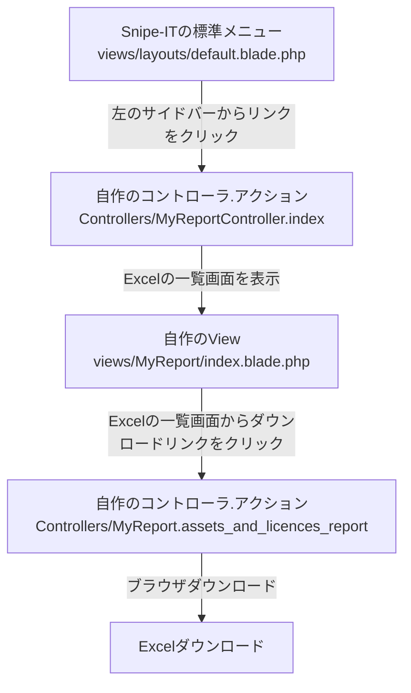
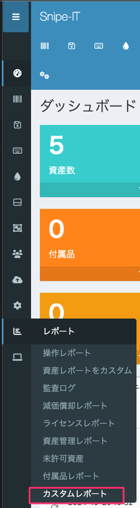
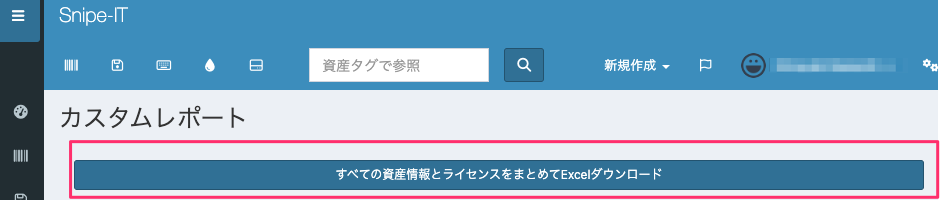
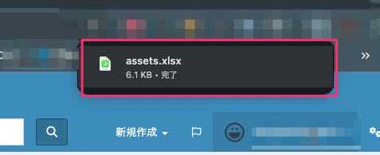
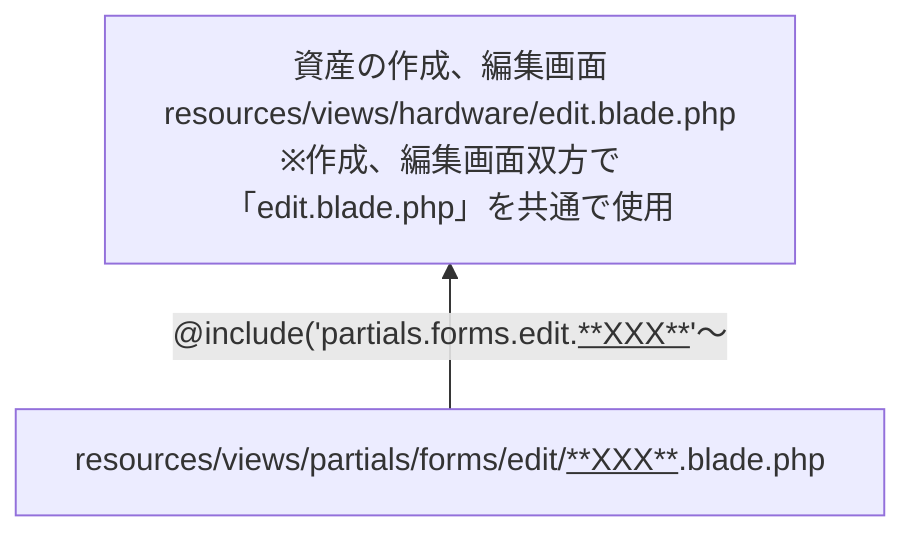
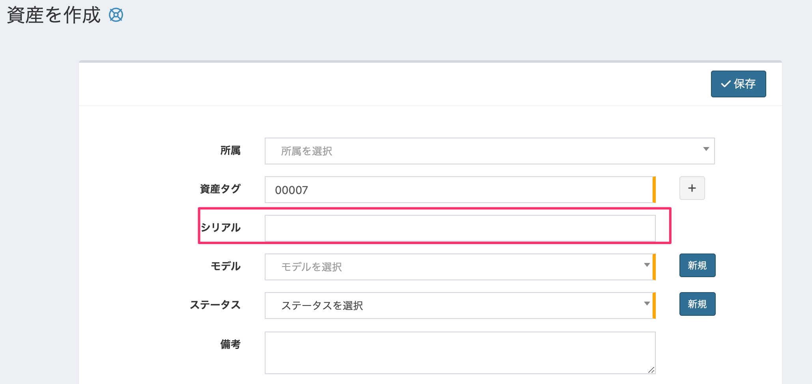
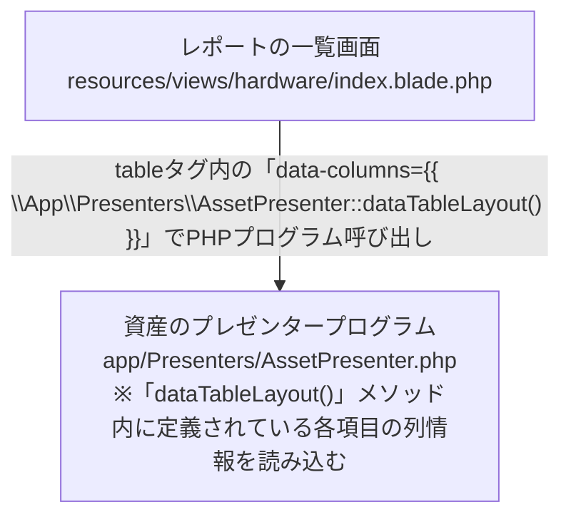
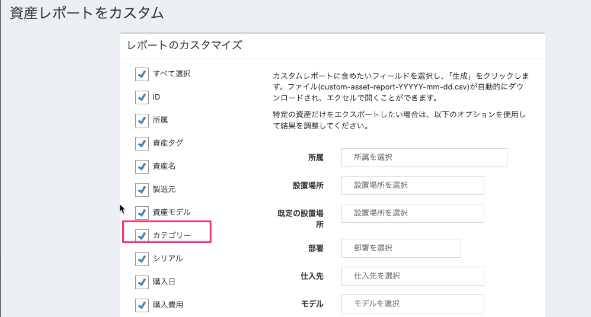

# はじめに

OSS製品であるSnipe-ITの機能改修に関する手順をここにまとめる。
なお、Snipe-IT`v7.0.13-pre`を前提としている。

前提とする環境は以下の通り。

| 項目名             | 値                                                     |
|-----------------|-------------------------------------------------------|
| OS           | Redhat9.5                                             |
| OSホスト名       | snipe-it-test                                         |
| MySQL           | 8.0.36                                                |
| PHP             | 8.1.27                                                |
| Apache          | 2.4.57                                                |
| Snipe-ITのバージョン  | 7.0.13                                                |
| Snipe-ITのディレクトリ | /var/www/snipeit                                      |


# 任意のSQLを実行してExcelダウンロードさせる機能を実装する

任意のSQLを実行し、その結果をExcelでダウンロードできる機能を実装する手順を記載する。

## 実装後のイメージ

### 作成するプログラムの仕様
本稿では、下記の構成であることを前提にする。

| 項目           | 値                         |
| -------------- | -------------------------- |
| コントローラ名 | MyReportController         |
| アクション     | assets_and_licenses_report |


### MVCフローチャート

MVCフローチャートは以下の通り。



### 画面の操作イメージ
1. 左のサイドバーのレポート一覧に`カスタムレポート`リンクが追加される。

    

2. リンクをクリックすると、カスタムレポートの一覧画面に遷移し、リンクをクリックするとExcelダウンロードが始まる。

    

    ↓

    

## ①Composerライブラリの導入
下記コマンドで必要なライブラリを導入しておくこと。
※後述の`php artisan make:export`コマンドを実行する際に必要となる

```bash
 composer require maatwebsite/excel
```


## ②エクスポートクラスを作成する
SQLを実行してExcel出力するためのエクスポートクラスを作成する。

以下のコマンドを実行してクラスを作成する。
```bash
php artisan make:export SqlExport
```

生成されたエクスポートクラスを以下の通り修正する。

app/Exports/SqlExport.php
```php
<?php

namespace App\Exports;

use Illuminate\Support\Facades\DB;
use Maatwebsite\Excel\Concerns\FromCollection;

// Excelにヘッダを付与するためのライブラリ
use Maatwebsite\Excel\Concerns\WithHeadings;

class SqlExport implements FromCollection, WithHeadings
{
    // ----- プロパティ変数
    protected $query;
    protected $headings;

    // ----- コンストラクタ
    // SQLクエリとヘッダを受け取る
    public function __construct($query, $headings = [])
    {
        $this->query = $query;
        $this->headings = $headings;
    }

    // ----- 各種メソッド
    /**
     * プロパティ変数のSQLを実行し、コレクションとして返す
     *
     * @return \Illuminate\Support\Collection
     */
    public function collection()
    {
        // クエリを実行して結果を返す
        return collect(DB::select($this->query));
    }

    /**
     * Excelのヘッダを配列として返す。
     *
     * @return array
     */
    public function headings(): array
    {
        // プロパティ変数のヘッダ情報を返す。もしプロパティ変数が存在しなれば空の配列を返す
        return $this->headings ?: [];
    }
}
```

## ③コントローラ作成

下記コマンドでコントローラを作成する。

```bash
php artisan make:controller MyReportController
```

作成したコントローラを以下の通り修正する。

app/Http/Controllers/MyReportController.php
```php
<?php

namespace App\Http\Controllers;

// DBアクセスに必要なライブラリ
use Illuminate\Support\Facades\DB;

// SQLで実行したデータセットをExcelでダウンロードさせるために必要なライブラリ
use App\Exports\SqlExport;
use Maatwebsite\Excel\Facades\Excel;

class MyReportController extends Controller
{
    /**
     * カスタムレポートのダウンロード一覧画面を表示するアクションメソッド
     */
    public function index()
    {
        return view('MyReport.index');
    }

    /**
     * 資産とライセンス情報を並列で抽出し、Excelでダウンロードさせるアクションメソッド。
     */

    public function assets_and_licences_report()
    {
        // SQLで使用する各種テーブル名を、モデルクラスから抽出する
        // ※文字列内でテーブル名を直書きしないようにするため
        $tableNameAsset = (new Asset())->getTable();
        $tableNameLicense = (new License())->getTable();
        $tableNameLicenseSeat = (new LicenseSeat())->getTable();

        // テーブルのカラム名と、Excelに出力するヘッダ名の対応配列変数を定義
        // ※general.phpで機械的に抽出できない日本語名があるため（資産名など）、明示的に定義
        // ※general.phpで取得できる項目については、trans()メソッドを用いて取得
        $columnHeaderHash = [
            // テーブルカラム名 => Excelヘッダ名
            "{$tableNameAsset}.name" => (trans('general.asset') . "名"),
            "{$tableNameLicense}.name" => trans('general.license'),
        ];
        // 連想配列からカラム名（Key）のみを抽出して配列変数に格納
        $columns = array_keys($columnHeaderHash);
        // 連想配列からExcelヘッダ名（Value）のみを抽出して配列変数に格納
        $headers = array_values($columnHeaderHash);

        //クエリビルダでSQLを生成し、文字列に変換して変数に格納する
        $sqlStr = DB::table($tableNameAsset)
            ->select($columns)
            ->leftJoin(
                $tableNameLicenseSeat
                , "{$tableNameAsset}.id", '=', "{$tableNameLicenseSeat}.asset_id"
            )
            ->leftJoin(
                $tableNameLicense
                , "{$tableNameLicenseSeat}.license_id", '=', "{$tableNameLicense}.id"
            )
            ->toSql()
        ;

        // Excelエクスポート用オブジェクトを定義
        $sqlExportObj = new SqlExport(
            $sqlStr,
            $headers
        );

        // Excelファイルのダウンロードを実行
        return Excel::download($sqlExportObj, '資産情報とライセンスの一覧.xlsx');
    }
}
```

## ④ルーティング設定
下記ファイルを編集し、ルーティングを編集する。

routes/web.php

```php
<?php
・・・
★↓追記
// 自作のカスタムレポートのルーティング情報
use App\Http\Controllers\MyReportController;
・・・

Route::group(['middleware' => ['auth']], function () {
・・・
	★↓追記
    // 自作のカスタムレポートのルーティング情報
    Route::get('/MyReport/assets_and_licences_report', [MyReportController::class, 'assets_and_licences_report']);
・・・
```

上記を追記したら、以下のアドレスにアクセスする。

http://<IPアドレス>/MyReport/assets_and_licences_report

# サイドバーに新たに自作のカスタムレポート画面へのリンクを作成する

「[前述の手順](#任意のSQLを実行してExcelダウンロードさせる機能を実装する)」で作成したコントローラに新たに`index`アクションを追加し、Snipe-ITのサイドバーにリンクを追加してアクセスできるようにする。

## ①コントローラ、ルーティング作成
まずコントローラにアクションを追加し、ルーティングを追加する。

app/Http/Controllers/MyReportController.php

```php
・・・
    /**
     * カスタムレポートのダウンロード一覧画面を表示するアクションメソッド
     */
    public function index()
    {
        return view('MyReport.index');
    }
・・・
```

routes/web.php

```php
・・・
    Route::get('/MyReport', [MyReportController::class, 'index']);
・・・
```

また、後述のビューに埋め込むリンクで使用するため、レポートダウンロード用のルーティングに名前をつける。

routes/web.php

```php
・・・
    // 資産情報とライセンスを並列で出力するレポートのダウロード用アクション
    Route::get('/MyReport/assets_and_licences_report', [MyReportController::class, 'assets_and_licences_report'])
        ->name('myreport/assets_and_licences_report');　★ここの設定を追記する
・・・
```

## ②ラベルの定義
Snipe-ITでは、ラベルはあらかじめ所定のPHPに定義する必要がある。
下記を追記する。

resources/lang/ja-JP/general.php

```php
<?php

return [
・・・
    // 自作のカスタムレポートのラベル
    'my_report'        => 'カスタムレポート',
・・・
```

上記で定義したラベルは下記で呼び出すことができる。
```php
{{ trans('general.my_report') }}
```

## ③カスタムレポートの一覧ビューの作成

先ほど作成したコントローラへのリンクするビューを作成する。

以下のビューを作成すること。
resources/views/CustomReport/index.blade.php
```php
@extends('layouts/default')

{{-- Page title --}}
@section('title')
{{ trans('general.my_report') }}
@parent
@stop

{{-- Page content --}}
@section('content')

<div class="text-center col-md-12" style="padding-top: 10px;">
  <a href="{{ route('myreport/assets_and_licences_report') }}" class="btn btn-primary btn-sm" style="width: 100%">
    すべての資産情報とライセンスをまとめてExcelダウンロード
  </a>
</div>

@stop

@section('moar_scripts')
@include ('partials.bootstrap-table')
@stop
```

※`{{ route('myreport/assets_and_licences_report') }}`は、「[[/コントローラ、ルーティング作成]]」で記述したルーティングの名前（`->name`）に対応する。

# 資産情報の標準項目を非表示にする

## 新規作成/編集画面の項目を非表示にする

### プログラムの構成

Snipe-ITで標準で存在する項目を画面上から非表示にしたい場合の手順を示す。

前提として、Snipe-ITでは下記の構成で画面項目を表示している。

[イメージ]



### 具体的な修正手順

ここでは資産情報の`シリアル`を非表示にする方法を記載する。



以下のファイルを変更する。

resources/views/partials/forms/edit/serial.blade.php
```html
<!-- Serial -->
<div class="form-group {{ $errors->has('serial') ? ' has-error' : '' }}">
    <label for="{{ $fieldname }}" class="col-md-3 control-label">{{ trans('admin/hardware/form.serial') }} </label>
    <div class="col-md-7 col-sm-12{{  (Helper::checkIfRequired($item, 'serial')) ? ' required' : '' }}">
        <input class="form-control" type="text" name="{{ $fieldname }}" id="{{ $fieldname }}" value="{{ old((isset($old_val_name) ? $old_val_name : $fieldname), $item->serial) }}" />
        {!! $errors->first('serial', '<span class="alert-msg" aria-hidden="true"><i class="fas fa-times" aria-hidden="true"></i> :message</span>') !!}
    </div>
</div>
```

↓

```html
<!-- Serial -->
{{-- ↓ここから↓

<div class="form-group {{ $errors->has('serial') ? ' has-error' : '' }}">
    <label for="{{ $fieldname }}" class="col-md-3 control-label">{{ trans('admin/hardware/form.serial') }} </label>
    <div class="col-md-7 col-sm-12{{  (Helper::checkIfRequired($item, 'serial')) ? ' required' : '' }}">

↑ここまでコメントアウト↑--}}

{{-- 「type="text"→「type="hidden"」に変更 --}}
        <input class="form-control" type="hidden" name="{{ $fieldname }}" id="{{ $fieldname }}" value="{{ old((isset($old_val_name) ? $old_val_name : $fieldname), $item->serial) }}" />

{{-- ↓ここから↓
            {!! $errors->first('serial', '<span class="alert-msg" aria-hidden="true"><i class="fas fa-times" aria-hidden="true"></i> :message</span>') !!}
    </div>
</div>
↑ここまでコメントアウト↑--}}
```

★`input`はコメントアウトしないこと。例え空欄の情報であっても、サーバにパラメータを送信しなければエラーを引き起こす。

## レポートの一覧画面から非表示にする

### プログラムの構成

まず、レポートの一覧画面は以下の構成になっている。



### 具体的な修正手順

下記の通りコメントアウトすれば良い。

app/Presenters/AssetPresenter.php
```php
...
                'sortable' => true,
                'switchable' => false,
                'title' => trans('admin/hardware/table.asset_tag'),
                'visible' => true,
                'formatter' => 'hardwareLinkFormatter',
            ],
             /* 一覧画面の「シリアル」のヘッダを非表示にする
            [
                'field' => 'serial',
                'searchable' => true,
                'sortable' => true,
                'title' => trans('admin/hardware/form.serial'),
                'visible' => true,
                'formatter' => 'hardwareLinkFormatter',
            ],
            */  [
                'field' => 'model',
                'searchable' => true,
...
```

## カスタムレポート画面から非表示にする

カスタムレポートで指定する項目を非表示にする。



修正箇所は以下の通り。

resources/views/reports/custom.blade.php

```html
・・・
              <label class="form-control">
                {{ Form::checkbox('category', '1', '1') }}
                {{ trans('general.category') }}
              </label>

              {{-- ↓ここから↓
              <label class="form-control">
                {{ Form::checkbox('serial', '1', '1') }}
                {{ trans('admin/hardware/table.serial') }}
              </label>
              ↑ここまでコメントアウト↑--}}

              <label class="form-control">
                {{ Form::checkbox('purchase_date', '1', '1') }}
                {{ trans('admin/licenses/table.purchase_date') }}
              </label>
・・・
```

# 参考

## Ansibleを用いたSnipe-IT構築

本リポジトリでは、Ansibleで自動的にSnipe-ITを構築できるようにプレイブックも同梱している。
必要なファイルは以下の通り。

| ファイル名                 | 概要                                                                                                               | 備考                                                                                          |
| --------------------- | ---------------------------------------------------------------------------------------------------------------- | ------------------------------------------------------------------------------------------- |
| snipe-it-playbook.yml | プレイブック本体。                                                                                                        | 本リポジトリ内の`ansible`フォルダに存在。                                                                   |
| ansible_settings.yml  | 上記プレイブック実行時に必要となる各種設定情報をまとめたファイル                                                                                 | 本リポジトリ内の`ansible`フォルダ内に雛形ファイル`ansible_settings.yml.example`が存在する。<br>コピーして各人の環境に合わせて編集すること。 |
| hosts                 | 構築対象のホスト情報が定義されているファイル。このホスト情報のIPをもとに、Snipe-ITのIPアドレスが割り当てられる（`.env`の`APP_URL`もこの値が設定される）。<br>各人の環境に応じて適宜作成すること。 |                                                                                             |

最終的に下記の構成になるようにファイルを配置すること。

```
ansible
└ansible_settings.yml
└snipe-it-playbook.yml
└hosts
```

実行例：
```bash
ansible-playbook -i hosts snipe-it-playbook.yml
```

上記実行後、`http://<対象ホストのIP>/setup`にアクセスすることで、Snipe-ITのプレフライト画面に遷移する。


## Snipe-ITのデザインを踏襲して新たなViewを作成する場合のポイント

そのままシンプルなHTMLを記述してしまうと、Snipe-ITのヘッダやフッタなどが表示されず、CSSも適用されないため、必ず下記の記述は漏れなく組み込んだうえでビューを作成すること。

```php
@extends('layouts/default')

{{-- Page title --}}
@section('title')
 ★★★任意のヘッダタイトル★★★
@parent
@stop

{{-- Page content --}}
@section('content')

★★★任意のHTMLを記述★★★

@stop

@section('moar_scripts')
@include ('partials.bootstrap-table')
@stop
```

次にSnipe-ITに標準で実装されているサイドバーのリンクメニューに、

